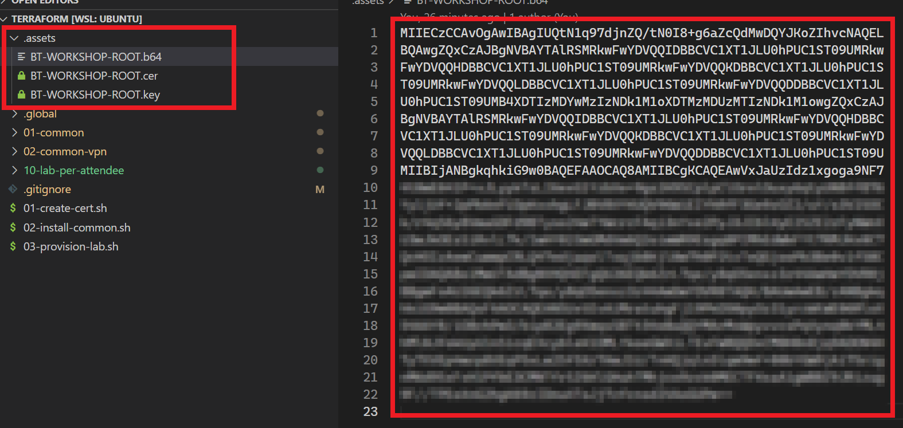
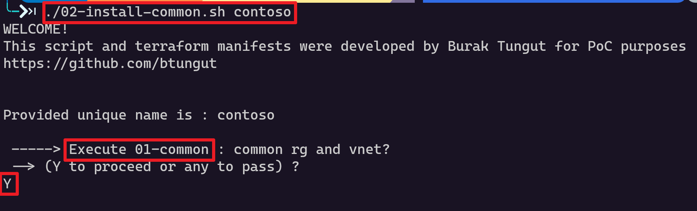
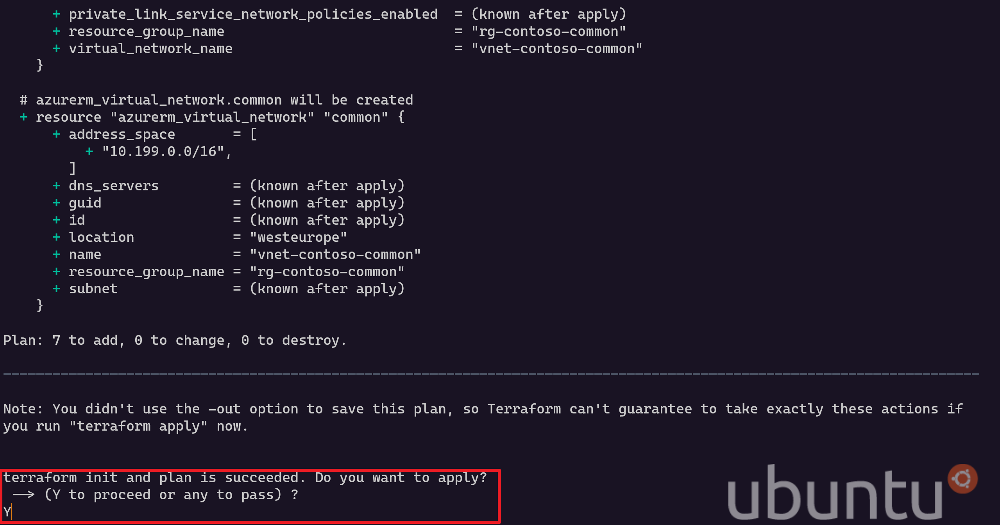
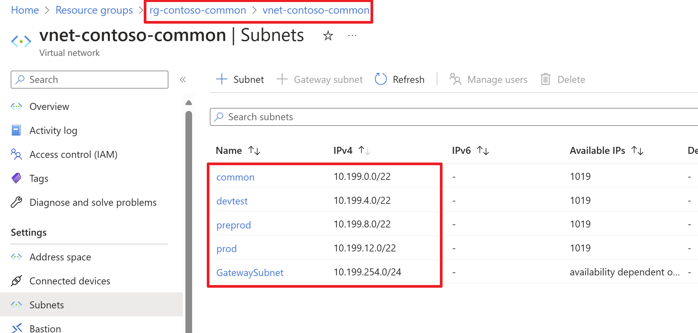
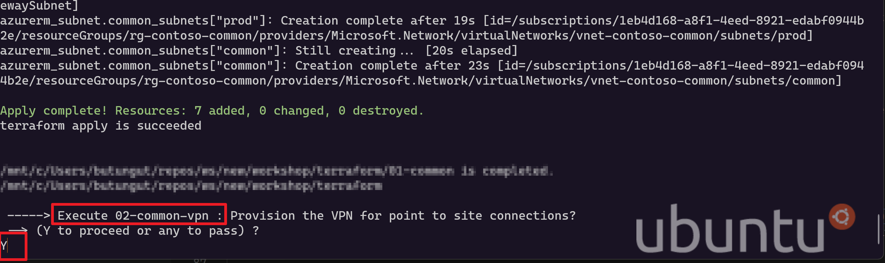
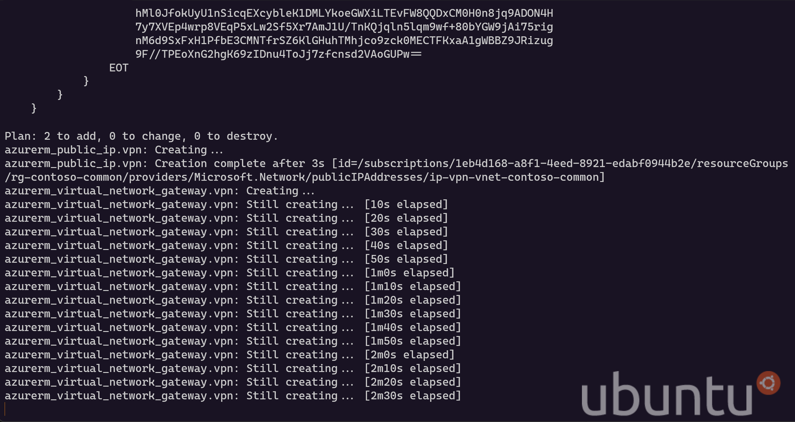

# Azure Workshop Lab Provisioning with Terraform

Assume you are a workshop instructor who needs to quickly set up the lab environments for the attendees. Without a doubt, you should have experience with IaaC tools in order to standardize your environment requirements in manifests.

## Context

This repository includes an implementation of Terraform manifests that responsible to create;

- Common VNET
  - devtest subnet
  - preprod subnet
  - prod subnet
  - VPN subnets
- VPN for created VNET
- Lab environment for attendees as much as demanded (e.g.: contoso and four attendees)
  - `rg-contoso-01-infra` Resource Group 
    - `acrworkshopbtcontoso01` Azure Container Registry
    - `vm-k3s-contoso-01-devtest` Virtual Machine
      - nic
      - os disk
    - `vm-k3s-contoso-01-preprod` Virtual Machine
      - nic
      - os disk
    - `vm-k3s-contoso-01-prod` Virtual Machine
      - nic
      - os disk
  - `rg-contoso-01-devtest` Resource Group
    - `kv-contoso-01-devtest` Azure KeyVault
    - `arc-k3s-contoso-01-devtest` **TODO** Arc-Enabled Kubernetes Cluster
  - `rg-contoso-01-preprod` Resource Group
    - `kv-contoso-01-preprod` Azure KeyVault
    - `arc-k3s-contoso-01-preprod` **TODO** Arc-Enabled Kubernetes Cluster
  - `rg-contoso-01-prod` Resource Group
    - `kv-contoso-01-prod` Azure KeyVault
    - `arc-k3s-contoso-01-prod` **TODO** Arc-Enabled Kubernetes Cluster


## Install 01 - Create Self Signed Certificate for VPN

1. To complete this task, please `cd` to root directory then run the following snippet:
    ```bash
    chmod +x ./01-create-cert.sh
    ./01-create-cert.sh
    ```

Once the execution is complete, three files should be created in `.assets` directory.
- BT-WORKSHOP-ROOT.key
- BT-WORKSHOP-ROOT.cer
- BT-WORKSHOP-ROOT.b64



## Install 02 - Create the common resources
You will provision the following resources in this step:
- Common Resource Group
  - Common VNet
    - Subnets
    - VPN Public IP
    - VPN

**NOTE THAT** This task may take longer than twenty minutes to complete due to the VPN provisioning time.

1. Please `cd` to root directory, then run the bash script with your unique name:
    ```bash
    chmod +x ./02-install-common.sh
    ./02-install-common.sh "contoso"
    ```

2. You will be prompted for `Execute 01-common` step which is responsible for common resource group, vnet and subnet creations.
    - **Type `Y` and press ENTER to continue.**

        

   - Once the `terraform plan` execution is completed, you will be informed about the resources to be created.
   Again, 
      - **Type `Y` and press ENTER to continue.**

        

    - Visit the Azure Portal once you see the `terraform apply is succeeded` message for this step. Below resources should be created in your Azure subscription.

        


3. Once the execution is completed, you will be again prompted for a task. This is for `Execute 02-common-vpn` step which is responsible for creation of VPN. This step may take several times to complete but also it is crucial for accessing the VM and VNET hosted on Azure.

      - This task is utilizing the certificate that located in `.assets` directory.

      - **Type `Y` and press ENTER to continue both for plan and execution.**
        

      - As it mentioned before, creation of the VPN may take more than twenty minutes.
        


## Install 03 - Provision the resources per attendee
TODO